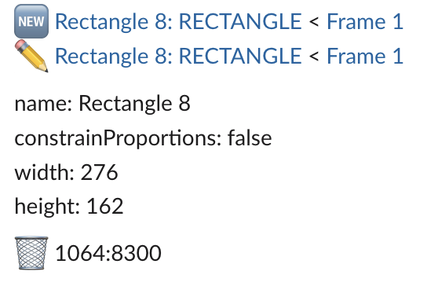

# Figma Notify Change Plugin

## How to use

1. clone this repository
1. `npm install`
2. `npm run build`
3. Menu > Resources > Plugins > Development > `+ (Create New Plugin)` > Import plugin from manifest
4. Speficy manifest.json
5. Select `Run`
6. Input below
    - slack incoming webhook url
    - figma personal access token
## Development

`npm run watch`

### Resources

- https://www.figma.com/plugin-docs/
- https://www.figma.com/plugin-docs/api/api-reference
